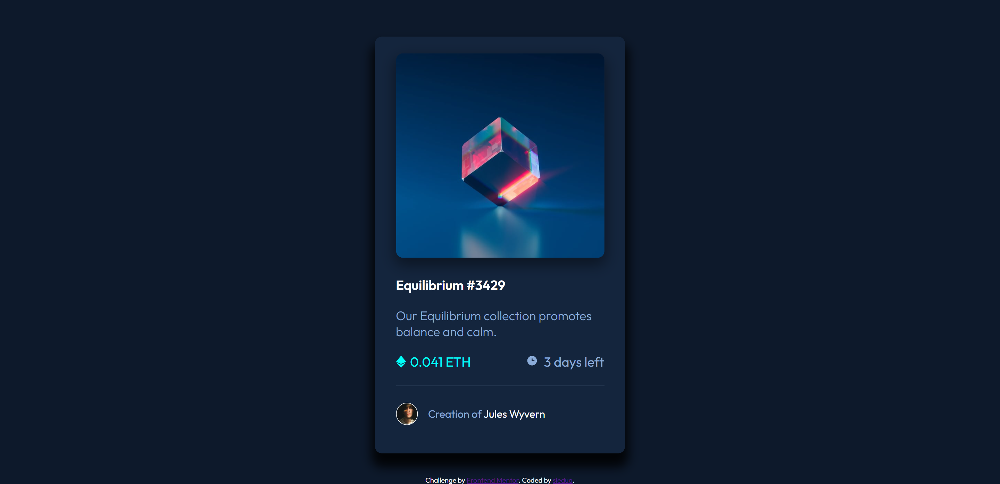

# Frontend Mentor - NFT preview card component solution

This is a solution to the [NFT preview card component challenge on Frontend Mentor](https://www.frontendmentor.io/challenges/nft-preview-card-component-SbdUL_w0U). Frontend Mentor challenges help you improve your coding skills by building realistic projects. 

## Table of contents

- [Frontend Mentor - NFT preview card component solution](#frontend-mentor---nft-preview-card-component-solution)
	- [Table of contents](#table-of-contents)
	- [Overview](#overview)
		- [The challenge](#the-challenge)
		- [Screenshot](#screenshot)
		- [Links](#links)
	- [My process](#my-process)
		- [Built with](#built-with)
		- [What I learned](#what-i-learned)
		- [Continued development](#continued-development)
	- [Author](#author)
	- [Acknowledgments](#acknowledgments)


## Overview

### The challenge

Users should be able to:

- View the optimal layout depending on their device's screen size
- See hover states for interactive elements

### Screenshot



### Links

- Solution URL: [GitHub](https://github.com/sledua/nft-preview-card-component-main)
- Live Site URL: [GitHub Pages](https://sledua.github.io/nft-preview-card-component-main/)

## My process

### Built with

- Semantic HTML5 markup
- CSS custom properties
- Flexbox
- Mobile-first workflow


### What I learned

Use this section to recap over some of your major learnings while working through this project. Writing these out and providing code samples of areas you want to highlight is a great way to reinforce your own knowledge.

To see how you can add code snippets, see below:

```html
<h1>Some HTML code I'm proud of</h1>
```
```css
.proud-of-this-css {
  color: papayawhip;
}
```
```js
const proudOfThisFunc = () => {
  console.log('🎉')
}
```
### Continued development

Use this section to outline areas that you want to continue focusing on in future projects. These could be concepts you're still not completely comfortable with or techniques you found useful that you want to refine and perfect.

## Author

- GitHub - [sledua](https://github.com/sledua)
- Frontend Mentor - [@sledua](https://www.frontendmentor.io/profile/sledua)
- Twitter - [@SledArtem](https://twitter.com/SledArtem)


## Acknowledgments

This is where you can give a hat tip to anyone who helped you out on this project. Perhaps you worked in a team or got some inspiration from someone else's solution. This is the perfect place to give them some credit.

